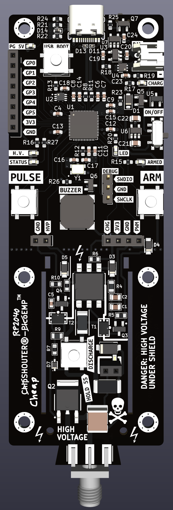

# cheapSHOUTER-RP2040EMP
Improved version of the great ChipSHOUTER-PicoEMP, this version has made cuts to the BOM and has added functionality inclduing: built in RP2040 instead of using a PICO, USB-C, LIPO charger + protection, USB isolation (not true isolation, allows to disconnect VBUS) + TVS diodes, buzzer, cleaner layout, and more.

## Contributors
- Colin O'Flynn (original HW design)
- Nezza (original FW)
- Kevin Pettersson 
- Linus Backlund
- Wilhelm Westermark

## Firmware
The firmware is a slightly tweaked version of the c-firmware from the original repo. The changes adapts the button logic to the active-high board design and activates the buzzer for a short period upon manual pulses.

## License

This work is licensed under a [Creative Commons Attribution-ShareAlike 3.0 International License][cc-by-sa].

[cc-by-sa]: http://creativecommons.org/licenses/by-sa/3.0/
[cc-by-sa-image]: https://licensebuttons.net/l/by-sa/3.0/88x31.png
[cc-by-sa-shield]: https://img.shields.io/badge/License-CC%20BY--SA%203.0-lightgrey.svg

ChipSHOUTER is a trademark of NewAE Technology Inc., registered in the US, European Union, and other jurisdictions.
PicoEMP is a trademark of NewAE Technology Inc.
